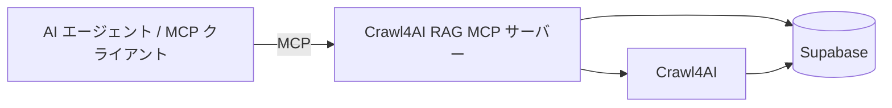

<h1 align="center">Crawl4AI RAG MCP サーバー</h1>

<p align="center">
  <em>AI エージェントと AI コーディングアシスタントのための Web クローリングと RAG 機能</em>
</p>

[Model Context Protocol (MCP)](https://modelcontextprotocol.io) を [Crawl4AI](https://crawl4ai.com) と [Supabase](https://supabase.com/) に統合した強力な実装で、AI エージェントや AI コーディングアシスタントに高度な Web クローリングと RAG 機能を提供します。

この MCP サーバーを使えば、<b>あらゆる情報をスクレイピング</b>し、<b>どこでもその知識を RAG に活用</b>できます。

主な目的は、この MCP サーバーを [Archon](https://github.com/coleam00/Archon) に組み込み、AI コーディングアシスタントが AI エージェントを構築するための知識エンジンへと進化させることです。Crawl4AI/RAG MCP サーバーの初期バージョンは今後大きく改善され、より多様な埋め込みモデルを利用したり、Ollama を使ってローカルで実行できるようにするなど、柔軟な設定が可能になります。

## 概要

この MCP サーバーは、AI エージェントがウェブサイトをクロールし、コンテンツをベクターデータベース（Supabase）に保存して RAG を実行するためのツールを提供します。これは、以前チャンネルで紹介した [Mem0 MCP サーバーテンプレート](https://github.com/coleam00/mcp-mem0/) に基づく、MCP サーバー構築のベストプラクティスに従っています。

サーバーには、検索品質を向上させる複数の高度な RAG 戦略があり、必要に応じて有効化できます。
- **コンテクスチュアル埋め込み** ― 文脈を強化したセマンティック理解
- **ハイブリッド検索** ― ベクター検索とキーワード検索の組み合わせ
- **エージェンティック RAG** ― コード例抽出に特化
- **リランキング** ― クロスエンコーダーモデルによる結果の関連度向上

これらの戦略を有効化・設定する方法は、下記の [設定](#configuration) セクションを参照してください。

## コンポーネント図

以下の図は、Crawl4AI RAG MCP サーバーが Crawl4AI および Supabase とどのように連携するかを示しています。



## ビジョン

Crawl4AI RAG MCP サーバーは始まりに過ぎません。今後の展望は次のとおりです。

1. **Archon との統合**: [Archon](https://github.com/coleam00/Archon) に直接組み込み、AI コーディングアシスタントがより優れた AI エージェントを構築できる包括的な知識エンジンを作成します。

2. **多様な埋め込みモデル**: OpenAI 以外のモデルにも対応し、Ollama を利用したローカル実行も含め、完全な制御とプライバシーを提供します。

3. **高度な RAG 戦略**: コンテクスチュアルリトリーバルやレイトチャンクなど、単純な検索を超えた洗練された手法を導入し、特に Archon と連携した際に RAG システムの精度と威力を大幅に高めます。

4. **高度なチャンク戦略**: Context 7 に着想を得たチャンク化アプローチを実装し、例を中心に意味のあるセクションを分割して検索精度を向上させます。

5. **パフォーマンス最適化**: クロールとインデックス作成の速度を上げ、新しいドキュメントを素早く取り込んで同じプロンプト内で活用できるようにします。

## Features

- **スマート URL 検出**: 通常のウェブページ、サイトマップ、テキストファイルなど URL の種類を自動判別
- **再帰的クロール**: 内部リンクをたどってコンテンツを取得
- **並列処理**: 複数ページを同時に効率よくクロール
- **コンテンツ分割**: 見出しやサイズでコンテンツを賢く分割
- **ベクター検索**: クロールしたコンテンツを対象に RAG を実行し、必要に応じてデータソースで絞り込み
- **ソース取得**: RAG のガイドとなるフィルタリング可能なソース一覧を取得

## Tools

このサーバーは、ウェブクロールと検索に必要な基本ツールを提供します。

### 基本ツール（常に利用可能）

1. **`crawl_single_page`**: 単一のウェブページを素早くクロールし、その内容をベクターデータベースに保存
2. **`smart_crawl_url`**: URL の種類（サイトマップ、llms-full.txt、通常ページ）に応じてサイト全体を賢くクロール
3. **`get_available_sources`**: データベースに登録されているすべてのソース（ドメイン）を取得
4. **`perform_rag_query`**: セマンティック検索で関連コンテンツを検索し、必要に応じてソースで絞り込み

### 条件付きツール

5. **`search_code_examples`**（`USE_AGENTIC_RAG=true` が必要）: クロールしたドキュメントからコード例とその概要を検索。AI コーディングアシスタント向けにコードスニペットを的確に取得します。

## 前提条件

- MCP サーバーをコンテナとして実行する場合は [Docker/Docker Desktop](https://www.docker.com/products/docker-desktop/)（推奨）
- MCP サーバーを直接実行する場合は [Python 3.12+](https://www.python.org/downloads/) と uv
- RAG 用データベースとして [Supabase](https://supabase.com/)
- 埋め込み生成に必要な [OpenAI API キー](https://platform.openai.com/api-keys)

## インストール

### Docker を利用する場合（推奨）

1. リポジトリをクローンします:
   ```bash
   git clone https://github.com/coleam00/mcp-crawl4ai-rag.git
   cd mcp-crawl4ai-rag
   ```

2. Docker イメージをビルドします:
   ```bash
   docker build -t mcp/crawl4ai-rag --build-arg PORT=8051 .
   ```

3. 下記の設定セクションを参考に `.env` ファイルを作成します

### Docker を使わず uv を直接利用する場合

1. リポジトリをクローンします:
   ```bash
   git clone https://github.com/coleam00/mcp-crawl4ai-rag.git
   cd mcp-crawl4ai-rag
   ```

2. uv がない場合はインストールします:
   ```bash
   pip install uv
   ```

3. 仮想環境を作成して有効化します:
   ```bash
   uv venv
   .venv\Scripts\activate
   # on Mac/Linux: source .venv/bin/activate
   ```

4. 依存関係をインストールします:
   ```bash
   uv pip install -e .
   crawl4ai-setup
   ```

5. 下記の設定セクションを参考に `.env` ファイルを作成します

## データベースのセットアップ

サーバーを実行する前に、pgvector 拡張機能を使ってデータベースを設定する必要があります。

1. Supabase ダッシュボードの SQL Editor を開きます（必要に応じて新しいプロジェクトを作成）

2. 新しいクエリを作成し、`crawled_pages.sql` の内容を貼り付けます

3. クエリを実行して必要なテーブルと関数を作成します

## 設定

プロジェクトのルートに次の変数を含む `.env` ファイルを作成します:

```
# MCP サーバー設定
HOST=0.0.0.0
PORT=8051
TRANSPORT=sse

# OpenAI API 設定
OPENAI_API_KEY=your_openai_api_key

# 要約とコンテクスチュアル埋め込み用 LLM
MODEL_CHOICE=gpt-4.1-nano

# RAG 戦略（"true" または "false"。デフォルトは "false"）
USE_CONTEXTUAL_EMBEDDINGS=false
USE_HYBRID_SEARCH=false
USE_AGENTIC_RAG=false
USE_RERANKING=false

# Supabase 設定
SUPABASE_URL=your_supabase_project_url
SUPABASE_SERVICE_KEY=your_supabase_service_key
```

### RAG 戦略オプション

この Crawl4AI RAG MCP サーバーでは、4 つの強力な RAG 戦略を個別に有効化できます。

#### 1. **USE_CONTEXTUAL_EMBEDDINGS**
有効にすると、ドキュメント全体の追加コンテキストを各チャンクの埋め込みに付与します。システムは全文と対象チャンクを LLM（`MODEL_CHOICE` で設定）に渡し、生成された豊かなコンテキストをチャンク内容とともに埋め込みます。

- **使用場面**: 文脈が重要な技術文書など、高精度な検索が必要な場合に有効化します。
- **トレードオフ**: 各チャンクで LLM を呼び出すためインデックス作成が遅くなりますが、検索精度は大幅に向上します。
- **コスト**: インデックス作成時に追加の LLM API コールが発生します。

#### 2. **USE_HYBRID_SEARCH**
従来のキーワード検索とセマンティックベクター検索を組み合わせ、より包括的な結果を得ます。両方の検索を並行して実行し、両方に現れた文書を優先して賢く統合します。

- **使用場面**: 特定の技術用語や関数名で検索する場合、あるいはキーワードの一致が重要なときに有効化します。
- **トレードオフ**: 検索クエリはやや遅くなりますが、特に技術文書で堅牢な結果が得られます。
- **コスト**: 追加の API コストはなく、計算負荷のみです。

#### 3. **USE_AGENTIC_RAG**
ドキュメントをクロールするとき、300 文字以上のコードブロックを検出し、周辺コンテキストと共に抽出して要約を生成し、コード検索用に設計された別のベクターテーブルに保存します。

- **使用場面**: ドキュメントから具体的なコード例や実装パターン、利用例を探す AI コーディングアシスタントに必須です。
- **トレードオフ**: コード抽出と要約のためクロールが大幅に遅くなり、ストレージも多く必要です。
- **コスト**: 各コード例の要約に追加の LLM API コールが発生します。
- **利点**: AI エージェントが特定の実装例を探す際に利用できる `search_code_examples` ツールを提供します。

#### 4. **USE_RERANKING**
初期検索後にクロスエンコーダーで結果を再ランク付けします。軽量なクロスエンコーダーモデル（`cross-encoder/ms-marco-MiniLM-L-6-v2`）を使い、クエリとの関連度で各結果をスコアリングし、関連度順に並び替えます。

- **使用場面**: 検索精度が最重要で、最も関連度の高い結果を上位に表示したい場合に有効です。セマンティック類似だけでは意図を捉えにくい複雑なクエリに特に役立ちます。
- **トレードオフ**: 結果数に応じて検索に 100～200ms ほど追加時間がかかりますが、結果の並びは大きく改善されます。
- **コスト**: 追加の API コストはなく、CPU で動作するローカルモデルを使用します。
- **利点**: 複雑なクエリでも関連度の高い結果が得られ、通常の RAG 検索にもコード検索にも利用できます。

### 推奨設定

**一般的なドキュメント向け RAG:**
```
USE_CONTEXTUAL_EMBEDDINGS=false
USE_HYBRID_SEARCH=true
USE_AGENTIC_RAG=false
USE_RERANKING=true
```

**コード例を扱う AI コーディングアシスタント向け:**
```
USE_CONTEXTUAL_EMBEDDINGS=true
USE_HYBRID_SEARCH=true
USE_AGENTIC_RAG=true
USE_RERANKING=true
```

**高速で基本的な RAG:**
```
USE_CONTEXTUAL_EMBEDDINGS=false
USE_HYBRID_SEARCH=true
USE_AGENTIC_RAG=false
USE_RERANKING=false
```

## サーバーの実行

### Docker を使用する場合

```bash
docker run --env-file .env -p 8051:8051 mcp/crawl4ai-rag
```

### Python を使用する場合

```bash
uv run src/crawl4ai_mcp.py
```

サーバーが起動すると、設定したホストとポートで待ち受けます。

## MCP クライアントとの統合

### SSE 設定

サーバーを SSE で起動したら、次の設定で接続できます。

```json
{
  "mcpServers": {
    "crawl4ai-rag": {
      "transport": "sse",
      "url": "http://localhost:8051/sse"
    }
  }
}
```

> **Windsurf ユーザーへの注意**: 設定では `url` ではなく `serverUrl` を使用してください。
> ```json
> {
>   "mcpServers": {
>     "crawl4ai-rag": {
>       "transport": "sse",
>       "serverUrl": "http://localhost:8051/sse"
>     }
>   }
> }
> ```
>
> **Docker ユーザーへの注意**: クライアントが別コンテナで動作している場合は `localhost` の代わりに `host.docker.internal` を使用してください。n8n でこの MCP サーバーを使う場合にも当てはまります。

### Stdio 設定

Claude Desktop や Windsurf など、任意の MCP クライアントの設定に次を追加します。

```json
{
  "mcpServers": {
    "crawl4ai-rag": {
      "command": "python",
      "args": ["path/to/crawl4ai-mcp/src/crawl4ai_mcp.py"],
      "env": {
        "TRANSPORT": "stdio",
        "OPENAI_API_KEY": "your_openai_api_key",
        "SUPABASE_URL": "your_supabase_url",
        "SUPABASE_SERVICE_KEY": "your_supabase_service_key"
      }
    }
  }
}
```

### Docker で Stdio を利用する設定

```json
{
  "mcpServers": {
    "crawl4ai-rag": {
      "command": "docker",
      "args": ["run", "--rm", "-i", 
               "-e", "TRANSPORT", 
               "-e", "OPENAI_API_KEY", 
               "-e", "SUPABASE_URL", 
               "-e", "SUPABASE_SERVICE_KEY", 
               "mcp/crawl4ai"],
      "env": {
        "TRANSPORT": "stdio",
        "OPENAI_API_KEY": "your_openai_api_key",
        "SUPABASE_URL": "your_supabase_url",
        "SUPABASE_SERVICE_KEY": "your_supabase_service_key"
      }
    }
  }
}
```

## 独自サーバーの構築

この実装は、より高度な Web クローリング機能を備えた MCP サーバーを構築するための基盤となります。独自のサーバーを構築するには次の手順を参考にしてください。

1. `@mcp.tool()` デコレーターを使って独自のツールを追加する
2. 独自の依存関係を組み込むために lifespan 関数を作成する
3. 必要に応じて `utils.py` を編集してヘルパー関数を追加する
4. より専門的なクローラーを追加してクロール機能を拡張する

